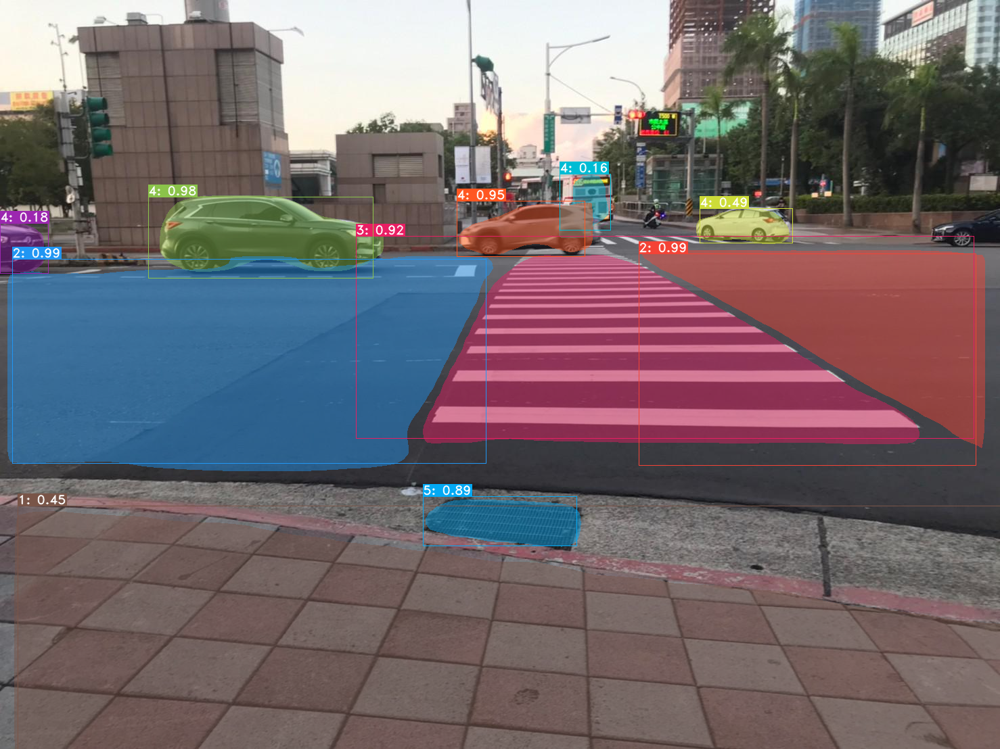

# Be Your Deep Eyes
Running testing data on Colaboratory, please click [` here `](https://colab.research.google.com/drive/1zX-Xrg19Cc8e_mQmhW7ObIwZMjkGrQWI?usp=sharing).  
For getting complete files, please download files [` here `](https://drive.google.com/drive/folders/1bLB9S-UIjCCLIHqkqjJ2_EVbtAzFYzrk?usp=sharing).  
# Labelme  
1. Sidewalk  
2. Traffic Lane  
3. Crosswalk  
4. Cars  
5. Obstacles  
6. People     


# Installation
- Install some other packages
```
!pip install cython
!pip install opencv-python pillow pycocotools matplotlib
!pip install torchvision==0.5.0
!pip install torch==1.4.0
```
- Build DCNv2
```
%cd /yolact/external/DCNv2
!python setup.py build develop
```

# Training Data
- Training Weights
```
!python train.py --config=yolact_base_config
```
- Pretrained Weights  
Please download pretrained weights [` yolact_edge_43_400000.pth `](https://drive.google.com/file/d/1-1oj2lMmGf7lqeURl24p0rLsxFJ4VNqL/view?usp=sharing) and put the corresponding weights file in the ` ./weights `
```
%cd /content/B-Protector/yolact
!mkdir -p weights
%cd weights
!gdown --id '1-1oj2lMmGf7lqeURl24p0rLsxFJ4VNqL'
```
# Run on Video
```
!mkdir -p results/output_video

file_path = "data/video/test_video.mp4"
output_path = "results/output_video.mp4"
!python eval.py --disable_tensorrt --config=yolact_edge_config --trained_model=weights/yolact_edge_43_400000.pth --score_threshold=0.3 --top_k=100 --video={file_path}:{output_path}
```

# Text to Speech
```
from gtts import gTTS  
  
mytext = '前方有障礙物，請往左兩步。' 
language = 'zh'
myobj = gTTS(text=mytext, lang=language, slow=False) 
myobj.save("output.mp3") 
```

# Demonstration video
https://user-images.githubusercontent.com/69901137/192931918-060662e1-0618-4565-b80d-68a1e1e0be33.mp4


